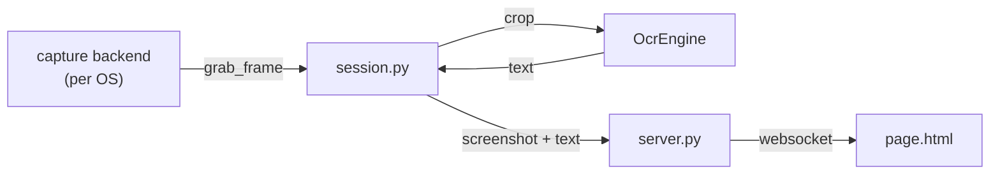

# Add a capture backend

The [video game / screen share](../how-to-use/video-game.md) source captures a window, and window capture is very OS-dependent. Each OS gets its own **capture backend** in `src/miningcat/infrastructure/capture/`, and MiningCat picks the one matching `sys.platform`:

| Backend | Module | Platform |
| ------- | ------ | -------- |
| Linux (Tested on Ubuntu, Wayland) | `linux_wayland.py` | `linux` |
| macOS | `macos.py` | `darwin` |
| Windows | `windows.py` | `win32` |

Everything else (areas, OCR, change detection, the web page, the GUI) is shared: a new backend only has to return images of a window.

## How it fits together


```mermaid
flowchart LR
    B["capture backend<br/>(per OS)"] -->|grab_frame| S[session.py]
    S -->|crop| O[OcrEngine]
    O -->|text| S
    S -->|screenshot + text| W[server.py]
    W -->|websocket| P[page.html]
```

- `infrastructure/capture/base.py`: the `CaptureBackend` interface, `WindowInfo` and `CaptureError`.
- `infrastructure/capture/__init__.py`: the per-OS switch (`BACKENDS`, `backend_info()`, `create_backend()`).
- `application/game_ocr/settings.py`: the selected window (`backend` id + `backend_state`) and the two areas, saved in `sources/game_ocr.json`.
- `application/game_ocr/session.py`: crops the screenshot and text areas, runs OCR with `infrastructure/ocr/engine.py`'s `OcrEngine`, and decides when the text changed (with `domain/ocr/`).
- `interfaces/game_page/server.py` + `page.html`: the local web page (aiohttp + websocket).
- `interfaces/cli/game_setup.py`: `python -m miningcat game setup|serve`. The web GUI (`interfaces/web/blueprints/game.py`) runs `game serve` in a subprocess (`application/game_ocr/capture_process.py`).

## 1. Write the backend

Create `src/miningcat/infrastructure/capture/your_os.py` with a `CaptureBackend` subclass:

```python
from PIL import Image

from miningcat.infrastructure.capture.base import CaptureBackend, CaptureError, WindowInfo


class YourOsCapture(CaptureBackend):
    # True if the OS shows its own window picker (like the Wayland portal),
    # False if MiningCat must list the windows itself (like on macOS).
    has_system_picker = False

    def __init__(self):
        # Import OS-specific libraries here, not at the top of the module:
        # the module is imported on every OS by the tests.
        ...

    def list_windows(self) -> list[WindowInfo]: ...
    def select_window(self, window: WindowInfo | None = None) -> None: ...
    def restore(self, state: dict) -> None: ...

    @property
    def state(self) -> dict: ...          # JSON data for restore()

    @property
    def window_label(self) -> str: ...    # shown in the GUI

    def grab_frame(self) -> Image.Image: ...   # RGB image of the window
    def close(self) -> None: ...
```

A few rules:

- **Raise `CaptureError` with an actionable message** for everything the user can fix (missing permission, window closed, missing system package...). The GUI shows it as is, and the CLI prints it.
- **`restore()` must not ask the user anything.** It reopens the window saved in `state`, even after a restart of MiningCat. If window ids don't survive a restart of the game, fall back on something stabler, like `macos.py` does with the app name and title.
- **`grab_frame()` is called about twice per second**: cache what's slow to look up (see `macos.py`'s ScreenCaptureKit filter cache).
- Calls always come from a single thread at a time, but not always the same one: don't rely on thread-local state.
- Imports of OS-specific libraries (pyobjc, PyGObject...) must stay inside the methods, so that the module imports anywhere.

If the backend needs a Python package, add it to `requirements.txt` with an environment marker, like pyobjc (`pyobjc; platform_system == "Darwin"`). If it needs system packages, document them.

## 2. Register it

Add a `BackendInfo` to `BACKENDS` in `src/miningcat/infrastructure/capture/__init__.py`:

```python
BackendInfo(
    id="your_os",
    label="Your OS (Tested on ...)",   # shown in the GUI's "Capture" line
    platforms=("win32",),              # sys.platform values
    module="miningcat.infrastructure.capture.your_os",
    class_name="YourOsCapture",
),
```

The `id` is saved in `sources/game_ocr.json` with the backend's `state`: never rename an existing one.

## 3. Capture key (optional)

The global capture key is OS-dependent too: one module per OS in `src/miningcat/infrastructure/hotkeys/`, `MacOSHotkey` (Quartz event tap), `WindowsHotkey` (low-level keyboard hook) and `GnomeHotkey` (a GNOME custom shortcut, since Wayland apps can't listen to the keyboard). Add a `Hotkey` subclass in a module for your OS and return it from `create_hotkey()` in `hotkeys/__init__.py`. Without one, the capture still works with the page's button and `POST /capture`, and the log explains it.

## 4. Tests

Add `src/tests/infrastructure/capture/your_os.test.py`, and **fake the OS libraries** so the tests run on the CI (Ubuntu) and on every contributor's machine. `macos.test.py` (fake `Quartz` / `ScreenCaptureKit` modules through `patch.dict("sys.modules", ...)`) and `linux_wayland.test.py` (fake D-Bus bus and GStreamer) are the references.

Also add your platform to the parametrized cases of `infrastructure/capture/factory.test.py`. `test_registered_modules_and_classes_exist` checks that the registry points at a real class.

Then try it for real (from `src/`): `python -m miningcat game setup`, then `python -m miningcat game serve`, and the GUI.

## Checklist

- [ ] New `CaptureBackend` subclass in `src/miningcat/infrastructure/capture/`, with lazy OS-specific imports
- [ ] Registered in `BACKENDS` in `src/miningcat/infrastructure/capture/__init__.py`
- [ ] Dependencies added to `requirements.txt` with an environment marker (if any)
- [ ] Capture key in `src/miningcat/infrastructure/hotkeys/` (optional)
- [ ] Tests with faked OS libraries
- [ ] Tried for real with the CLI and the GUI
- [ ] [Video games & screen share](../how-to-use/video-game.md) updated: supported systems table, setup for your OS
- [ ] `make test` passes
