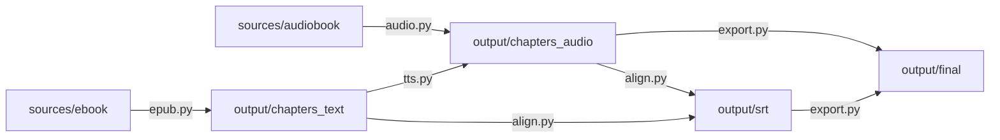

# Project structure

MiningCat is a plain Python project: no package to install, modules are run from `src/`.

```text
src/
├── main.py                 # CLI entry point (argparse subcommands)
├── gui.py                  # GUI entry point (Tkinter)
├── gui_config.py           # GUI look (colors, fonts, window size)
├── gui_components/         # GUI panels, dialogs and the GUI pipeline runner
├── config.py               # paths (sources/, output/...) and global settings
├── language.py             # Language enum: everything language-specific
│
├── audio.py                # step 1: split/copy audio into chapters
├── epub.py                 # step 2: extract book text into chapters
├── align.py                # step 3: Whisper alignment / transcription : SRT
├── tts.py                  # edge-tts audio generation (Generate audio mode)
├── export.py               # step 4: render MP4 with embedded subtitles
├── chinese_converter.py    # simplified / traditional conversion (OpenCC)
├── frequency/              # word frequency and Kanji Grid character lists
│
├── video.py                # video pipeline: download, transcribe/OCR, mux
├── video_downloader.py     # picks the right handler for a URL
├── video_handlers/         # one module per platform (yt-dlp based)
├── ocr_mining/             # hardsubs OCR: frames : text : deduplicated segments
│
└── tests/                  # pytest tests (*.test.py) and mock files
```

## Audiobook pipeline

Each step reads the output of the previous one from `output/` (see [Files and folders](../how-to-use/files.md)):



- **Standard mode**: `audio` : `epub` : `align.run()` : `export`
- **Generate subtitles mode**: `audio` : `align.run_transcribe()` : `export`
- **Generate audio mode**: `epub` : `tts` (writes both audio and subtitles) : `export`

The GUI runs the same steps through `gui_components/pipeline.py`, after copying the selected files into `sources/`.

## Video pipeline

`video.run()`:

1. gets the video: `video_downloader.download_video()` picks a handler from `video_handlers/` based on the URL domain, or uses the local file directly;
2. builds subtitles, either with Whisper on the extracted audio, or with `ocr_mining.pipeline.generate_segments()` for hardsubs;
3. collects existing subtitles (platform captions, sidecar `.srt`, embedded text tracks);
4. muxes every subtitle track into the final MP4.

## Language-specific code

Everything that depends on the language goes through the `Language` enum in `language.py`. Adding a language mostly means adding an enum member, plus a few lookup tables keyed by `Language`. See [Add a language](add-language.md).
