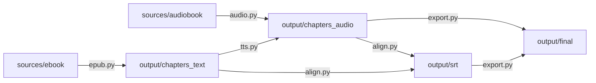

# Project structure

MiningCat is a plain Python project: no package to install, modules are run from `src/`.

```text
src/
├── main.py                 # CLI entry point (argparse subcommands)
├── web_gui.py              # GUI entry point (local web server, opens the browser)
├── web/                    # web GUI: Flask app, ebook reader, templates/ and static/ (HTML, CSS, JS)
├── mining/                 # dictionaries, lookups, word statuses, Anki (SQLite database)
├── gui.py                  # previous GUI entry point (Tkinter, `make gui-tk`)
├── gui_config.py           # Tkinter GUI look (colors, fonts, window size)
├── gui_components/         # pipeline runner + shared constants used by both GUIs, Tkinter panels
├── config.py               # paths (sources/, output/...) and global settings
├── language.py             # Language enum: everything language-specific
│
├── audio.py                # step 1: split/copy audio into chapters
├── epub.py                 # step 2: extract book text into chapters
├── align.py                # step 3: Whisper alignment / transcription : SRT
├── tts.py                  # edge-tts audio generation (Generate audio mode)
├── export.py               # step 4: render MP4 with embedded subtitles
├── chinese_converter.py    # simplified / traditional conversion (OpenCC)
├── frequency/              # word frequency and Kanji Grid character lists
│
├── video.py                # video pipeline: download, transcribe/OCR, mux
├── video_downloader.py     # picks the right handler for a URL
├── video_handlers/         # one module per platform (yt-dlp based)
├── ocr_mining/             # hardsubs OCR: frames : text : deduplicated segments
├── game_ocr/               # video game / screen share OCR: window : text : web page
│   └── capture/            #   one window capture backend per OS
│
└── tests/                  # pytest tests (*.test.py) and mock files
```

## Audiobook pipeline

Each step reads the output of the previous one from `output/` (see [Files and folders](../how-to-use/files.md)):


```mermaid
flowchart LR
    A[sources/audiobook] -->|audio.py| B[output/chapters_audio]
    E[sources/ebook] -->|epub.py| T[output/chapters_text]
    T -->|tts.py| B
    B -->|align.py| S[output/srt]
    T -->|align.py| S
    B -->|export.py| F[output/final]
    S -->|export.py| F
```

- **Standard mode**: `audio` : `epub` : `align.run()` : `export`
- **Generate subtitles mode**: `audio` : `align.run_transcribe()` : `export`
- **Generate audio mode**: `epub` : `tts` (writes both audio and subtitles) : `export`

The GUI runs the same steps through `gui_components/pipeline.py`, after copying the selected files into `sources/`.

## Web GUI

`web_gui.py` starts a Flask server on `127.0.0.1` and opens the page in the browser:

- `web/app.py`: the HTTP API. Each button of the page calls one route; long jobs reuse `gui_components/pipeline.py` in a background thread.
- `web/state.py`: the running job and an event bus. The page follows the log and the progress bar through Server-Sent Events (`/api/events`), so reloading the page doesn't lose them.
- `web/files.py`: files picked in the browser are uploaded to `sources/.staging/` (a browser can't give a file path), then the pipeline copies them where it needs them.
- `web/options.py`: the dropdown contents (conversions, voices, precision levels per language).
- `web/book_audio.py`: the audio of a converted book (`output/chapters_audio` + `output/srt`, copied next to the book). A sentence is found in the subtitles by its text, then played with the chapter's audio, or cut with ffmpeg for the card creator.
- `web/game.py`: the *Video game / Screen share* source. It saves the window and areas in `sources/game_ocr.json` (window list, a fresh capture for the area picker), then runs `main.py game serve` as a job, like the Tkinter panel. `templates/game.html` and `static/game.js` are the page showing the captures (through the capture server's websocket) with the dictionary popup.
- `web/books.py` and `web/reader.py`: the ebook reader. Books are imported once into `library/`: each chapter is rendered to a clean HTML fragment (no publisher scripts or styles), and the reading progress is stored next to it. `templates/reader.html` and `static/reader.js` do the pagination with CSS columns, horizontally or vertically.
- `web/videos.py` and `web/player.py`: the video player. Videos are imported into `library/videos/` (hard-linked when they come from `output/`), then prepared once in a background thread: ffprobe, thumbnail, text subtitle tracks extracted from the file (in one pass), and an MP4 copy only when the browser can't play the original. When the browser still fails, the page asks for more: a remux into MP4 first, a re-encode only when the browser can't decode the codec (`videos.play_plan()`). Subtitles are stored as SRT; a line's audio is cut with ffmpeg for the card creator, and the screenshot is taken in the browser from the `<video>`. `templates/player.html` and `static/player.js` show the subtitles over the video and in a list, with the dictionary popup.
- `web/templates/index.html` and `web/static/`: the page itself, plain HTML/CSS/JS with no build step.

## Mining (dictionaries, words, Anki)

`src/mining/` has no web code, so it can be used from the CLI or tests:

- `db.py`: the SQLite database `library/miningcat.db` (dictionaries, words, cards, settings).
- `dictionaries.py`: imports Yomitan-format dictionaries (zip of JSON banks).
- `deinflect.py` and `transforms/`: Yomitan's deinflection rules, ported to Python (exported by `tools/export_yomitan_transforms.mjs`).
- `lookup.py`: finds the entries for the text at the cursor, longest match first.
- `segment.py`: splits a whole chapter into dictionary words, to colour them by status. The headwords of the enabled dictionaries are loaded in memory once per language; the reader sends the chapter's text and colours the words with the CSS Custom Highlight API, so the page's DOM (and the reading position) is untouched.
- `words.py`: word statuses per language, Chinese scripts.
- `hangul.py`: splits Hangul into jamo and back (port of Hangul.js), for the Korean deinflection rules.
- `word_audio.py`: online recordings of a word (JapanesePod101, Wiktionary, Lingua Libre), fetched only when asked.
- `zhuyin.py`: pinyin to zhuyin, for the `{zhuyin}` field of Mandarin cards.
- `anki.py`: AnkiConnect, the card queue, status sync and `.apkg` export (genanki).

`web/mining_api.py` exposes them over HTTP, `static/mining.js` is the popup and the card creator, and `templates/settings.html` the Settings page. `tests/fake_ankiconnect.py` is an in-memory AnkiConnect used by the tests; run it with `python src/tests/fake_ankiconnect.py` to try MiningCat without Anki.

Mutating API routes require an `X-MiningCat: 1` header and the server only answers to `localhost`, so other websites open in the browser can't drive it.

## Video pipeline

`video.run()`:

1. gets the video: `video_downloader.download_video()` picks a handler from `video_handlers/` based on the URL domain, or uses the local file directly;
2. builds subtitles, either with Whisper on the extracted audio, or with `ocr_mining.pipeline.generate_segments()` for hardsubs;
3. collects existing subtitles (platform captions, sidecar `.srt`, embedded text tracks);
4. muxes every subtitle track into the final MP4.

## Video game / screen share

`main.py game serve` (run by the GUI in a subprocess, so that **Stop** can end it):

1. reopens the window saved in `sources/game_ocr.json` with the capture backend of the current OS (`game_ocr/capture/`);
2. on each press of the capture key (`game_ocr/hotkey.py`), or about twice per second in continuous mode, grabs a frame and crops the screenshot area and the text area (`game_ocr/session.py`);
3. reads the text area with `ocr_mining.engine.OcrEngine` (in continuous mode, only once it changed and settled);
4. pushes the screenshot + text to the page through a websocket (`game_ocr/server.py`).

See [Add a capture backend](add-capture-backend.md) to support another OS.

## Language-specific code

Everything that depends on the language goes through the `Language` enum in `language.py`. Adding a language mostly means adding an enum member, plus a few lookup tables keyed by `Language`. See [Add a language](add-language.md).
