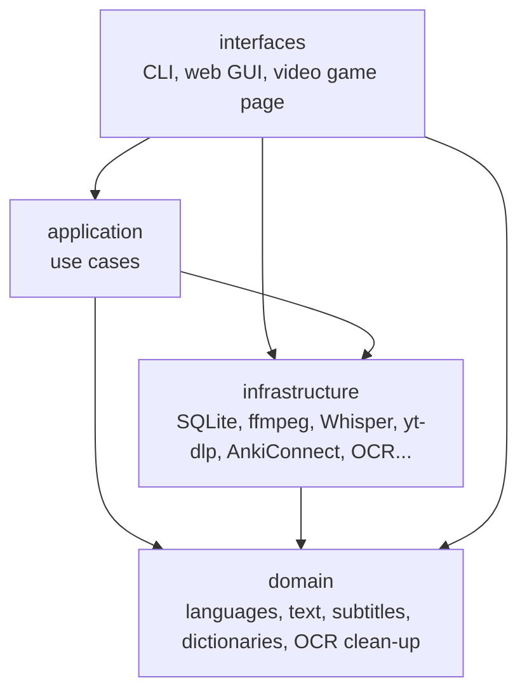
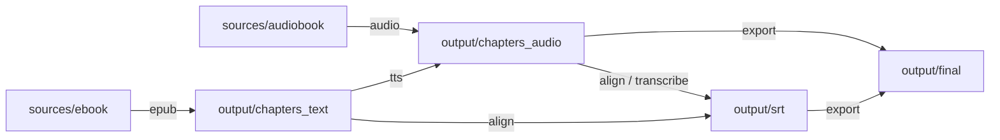

# Project structure

MiningCat is one Python package, `miningcat`, in `src/`. It follows a layered ("clean") architecture: the code is
split by what it depends on, and each layer only uses the layers below it.


```mermaid
flowchart TB
    I["interfaces<br/>CLI, web GUI, video game page"] --> A["application<br/>use cases"]
    I --> F["infrastructure<br/>SQLite, ffmpeg, Whisper, yt-dlp, AnkiConnect, OCR..."]
    A --> F
    A --> D["domain<br/>languages, text, subtitles, dictionaries, OCR clean-up"]
    F --> D
    I --> D
```

| Layer            | What it holds                                                                                              | May import                          |
| ---------------- | ---------------------------------------------------------------------------------------------------------- | ----------------------------------- |
| `domain`         | Language data and pure algorithms. No file, network or database access.                                    | nothing of the package              |
| `infrastructure` | Adapters to the outside world: the database, ffmpeg, Whisper, edge-tts, yt-dlp, AnkiConnect, OCR engines... | `domain`, `config`                  |
| `application`    | The use cases: converter steps and jobs, dictionary lookups, cards, libraries, the video game capture.     | `domain`, `infrastructure`, `config` |
| `interfaces`     | What the user runs: the CLI, the web GUI, the page of `game serve`.                                         | everything                          |
| `config`         | Where files live (`paths`) and how the app runs its own processes.                                         | nothing of the package              |

`src/tests/architecture.test.py` checks these rules: a pull request that breaks them fails.

## Running it

- `python -m miningcat <command>`: the CLI (`interfaces/cli/`). Each subcommand is a `Command` object.
- `python -m miningcat.interfaces.web`: the web GUI, a Flask server on `127.0.0.1` that opens the browser.
- The `Makefile` runs both from the project root (`make gui`, `make epub`...), with `PYTHONPATH=src`.

The web GUI runs each converter step in its own process (`python -m miningcat audio`, `epub`, `align`...), so that
the heavy libraries (Whisper, OCR) stay out of the server and the step's output becomes the job's log.

## Where things are

```text
src/miningcat/
├── config/
│   ├── paths.py              # ProjectPaths: every folder (sources/, output/, library/, user/), all under one root
│   └── runtime.py            # the Python interpreter, and `python -m` command lines of the package
├── domain/
│   ├── languages/            # Language (the converter's variants, built with LanguageProfileBuilder), study languages
│   ├── text/                 # writing systems, kana, readings, Chinese scripts (ChineseScripts), zhuyin, Hangul,
│   │                         #   taigi/ (Hanji, Tâi-lô, Pe̍h-ōe-jī and the conversions between them)
│   ├── subtitles/            # Segment, SRT, punctuation fixes, finding a sentence in subtitles
│   ├── dictionary/           # deinflection (+ Yomitan's transforms/), glossaries, definition merging, frequency ranks
│   ├── segmentation/         # splitting a text into dictionary words (lexicon, splitter)
│   ├── sentence_readings/    # Mandarin readings chosen from the context, for cards
│   ├── words/ cards/         # word statuses and forms, card fields
│   ├── ocr/                  # regions, frame and text similarity, segments from OCR readings, comic page layout
│   ├── audiobook/ ebook/ frequency_lists/ library/
├── infrastructure/
│   ├── persistence/          # Database, SettingsStore, repositories (words, cards, dictionaries), DictionaryQueries
│   ├── media/                # ffmpeg: FfmpegCommand builder, m4b chapters, video files, browser copies, title cards...
│   ├── speech/               # Whisper, edge-tts; local engines for the languages they lack (Taigi): Qwen3-ASR, MMS
│   ├── downloads/            # one VideoHandler per platform (yt-dlp), and their registry
│   ├── capture/ hotkeys/     # window capture and the global capture key, one module per OS
│   ├── ocr/                  # OcrEngine (owocr), and the OCR worker process of comics
│   ├── anki/                 # AnkiConnect client, .apkg writer
│   ├── word_audio/           # one AudioSource per website (JapanesePod101, Wiktionary, Lingua Libre)
│   ├── translation/          # NLLB-200 and its install
│   ├── dictionaries/ ebooks/ files/ system/ http.py
├── application/
│   ├── converter/            # steps/ (audio, ebook, subtitles, tts, export), speech engines, video pipeline, jobs...
│   ├── mining/               # lookup, segmentation, words, preferences, dictionaries, comprehension, translation...
│   ├── anki/                 # Anki setup, card queue, AnkiSync, .apkg export
│   ├── library/              # books/, comics/, videos/ of the reader and the player, the audio of converted books
│   ├── game_ocr/             # the saved window and areas, the capture session, the `game serve` process
│   └── study_language.py     # the language the user studies
└── interfaces/
    ├── cli/                  # main.py, one Command per subcommand, `game setup` and its area picker (in the browser)
    ├── web/                  # app.py (factory), blueprints/ (one per screen or API), templates/, static/
    └── game_page/            # the page of `game serve` (aiohttp + websocket)
```

Most packages of `application/` have an `__init__.py` that gathers their public functions (a facade): the web GUI
imports `application.anki` or `application.library.books`, never their inner modules.

## Audiobook pipeline

Each step reads the output of the previous one from `output/` (see [Files and folders](../how-to-use/files.md)):


```mermaid
flowchart LR
    A[sources/audiobook] -->|audio| B[output/chapters_audio]
    E[sources/ebook] -->|epub| T[output/chapters_text]
    T -->|tts| B
    B -->|align / transcribe| S[output/srt]
    T -->|align| S
    B -->|export| F[output/final]
    S -->|export| F
```

The steps are in `application/converter/steps/`. Their mode (`ConversionMode`: Standard, Generate subtitles,
Generate audio) says which ones run; `AudiobookJob` runs them one by one with `CliCommand`, and reports to a
`ProgressListener` (the web GUI publishes it to the page through Server-Sent Events). Requests are built with
`AudiobookRequestBuilder` and `VideoRequestBuilder`, which check the user's choices as they go.

`Alignment` and `Transcription` share their loop over the chapters (`ChapterSubtitles`, a template method): they only
say what the chapters are, their speech model and how their subtitles are made. `speech_engines.py` picks the model of
the language's profile: Whisper, or the local engines of the languages it doesn't know (Qwen3-ASR transcribes Taigi,
Meta's MMS aligner aligns it).

## Video pipeline

`VideoSubtitles` (`application/converter/video_subtitles.py`):

1. gets the video: `download_video()` picks a handler from `infrastructure/downloads/` based on the URL domain, or uses
   the local file directly;
2. keeps the subtitles the video came with (platform captions, sidecar `.srt`, embedded text tracks);
3. makes its own with a `SubtitleMaker`: `SpeechSubtitles` on the extracted audio, or `OcrSubtitles` for hardsubs;
4. converts the script if asked (Chinese characters, or Taigi's writing systems), then muxes every subtitle track into the final MP4.

## Web GUI

`interfaces/web/app.py` registers the blueprints of `interfaces/web/blueprints/`, the `security.guard()` hook (the
server only answers to `localhost`, and mutating requests need an `X-MiningCat: 1` header, so other websites open in
the browser can't drive it) and the error handlers of `errors.py` (each error of the app becomes a dialog).

- `jobs.py` and `event_bus.py`: the running job (one at a time) and the events the page follows (`/api/events`).
- `uploads.py`: files picked in the browser are uploaded to `sources/.staging/`, then the pipeline copies them where it
  needs them.
- `blueprints/converter*.py`: the converter's options, jobs, files and results; `words.py`, `dictionaries.py`,
  `cards.py`, `sentence_tools.py`: the dictionary popup and the card creator; `books.py`, `book_audio.py`, `comics.py`:
  the reader; `videos.py`: the player; `game.py`: the video game capture.
- `static/csv_cards.js`: the converter's *CSV to cards* source, which makes a card per row with the card creator's
  own parts (`MiningCatMining.cardParts` of `static/mining.js`).

### Pages: Bootstrap

The pages are built with [Bootstrap 5.3](https://getbootstrap.com/docs/5.3/) and
[Bootstrap Icons](https://icons.getbootstrap.com/), copied in `static/vendor/` (the app works offline: no CDN). Write
the markup with Bootstrap's components and utility classes (`card`, `btn`, `form-select`, `modal`, `offcanvas`,
`d-flex gap-2`...) and its icons (`<i class="bi bi-trash"></i>`), in the templates as in the scripts that build HTML.

- `templates/base.html`: what every page loads (Bootstrap, the theme, `ui.js`); `_macros.html`: the header (`navbar()`).
- `static/theme.css`: MiningCat's colours, as Bootstrap variables (the orange primary, light, dark and the reader's
  sepia mode), and the highlight colours of the text (`--mc-hl-*`: the default palette and two for colour blindness).
  Bootstrap is used without Sass: a colour changes here, not in the pages.
- `static/theme.js`: the user's colour preferences (`application/user_preferences.py`, kept in
  `user/user-config.json`, `/api/preferences`), written on `<html>` by `base.html` and applied before the page is
  drawn: the colour mode (`data-bs-theme`: light, dark or the system's; the reader sets its own while a book is read
  with `MiningCatTheme.set()`) and the highlight palette (`data-mc-highlights`). Controls only need an attribute:
  `data-mc-theme-toggle`, `data-mc-theme-choice`, `data-mc-highlights-choice`.
- `discord_status.py`: the user's Discord status (Rich Presence), from the page last opened and the language studied;
  `infrastructure/system/discord_presence.py` sends it to the Discord app from a thread. It needs the Application ID
  of a Discord application (`DISCORD_CLIENT_ID`, or the `MININGCAT_DISCORD_CLIENT_ID` environment variable), whose
  name is the one Discord shows and whose Rich Presence art asset `logo` is the image (`docs/assets/logo/miningcat.png`).
- `static/ui.js`: the message dialogs (`MiningCatUI.dialog()`, a Bootstrap modal) and the toasts (`MiningCatUI.toast()`).
- Custom CSS only for what Bootstrap has no class for, its classes starting with `mc-`: `static/app.css` (shared by
  the pages), and the engines of the screens: `reader.css` (the paginated book), `player.css` (the subtitles over the
  video), `comic.css` (the text over the pages), `mining.css` (the words highlighted in the text, the definitions,
  the waveform).
- The scripts show and hide elements with the `hidden` attribute (`app.css` makes it win over `d-flex` and the like).

## Mining (dictionaries, words, Anki)

- `infrastructure/persistence/`: the SQLite database `library/miningcat.db` (dictionaries, words, cards, settings).
  The SQL lives in the repositories and in `DictionaryQueries`, never in the use cases.
- `application/mining/dictionaries/`: imports Yomitan-format dictionaries and frequency lists (a `DictionaryImporter`
  per kind of file), in the background.
- `domain/dictionary/deinflection.py` and `transforms/`: Yomitan's deinflection rules, ported to Python (exported by
  `tools/export_yomitan_transforms.mjs`).
- `application/mining/lookup.py`: `DictionaryLookup` finds the entries for the text at the cursor, longest match
  first.
- `application/mining/segmentation.py`: splits a whole chapter into dictionary words, to colour them by status. The
  headwords of the enabled dictionaries are loaded in memory once per language.
- `application/anki/`: AnkiConnect, the card queue, status sync and `.apkg` export.

`tests/fake_ankiconnect.py` is an in-memory AnkiConnect used by the tests; run it with
`python src/tests/fake_ankiconnect.py` to try MiningCat without Anki.

## Video game / screen share

`python -m miningcat game serve` (run by the web GUI in a subprocess, so that **Stop** can end it):

1. reopens the window saved in `sources/game_ocr.json` with the capture backend of the current OS
   (`infrastructure/capture/`);
2. on each press of the capture key (`infrastructure/hotkeys/`), or about twice per second in continuous mode,
   grabs a frame and crops the screenshot area and the text area (`application/game_ocr/session.py`);
3. reads the text area with `OcrEngine` (in continuous mode, only once it changed and settled);
4. pushes the screenshot + text to the page through a websocket (`interfaces/game_page/server.py`).

See [Add a capture backend](add-capture-backend.md) to support another OS.

## Language-specific code

Everything that depends on the language variant goes through its `LanguageProfile`
(`domain/languages/language.py`): adding a language mostly means adding a member to the `Language` enum. See
[Add a language](add-language.md).
