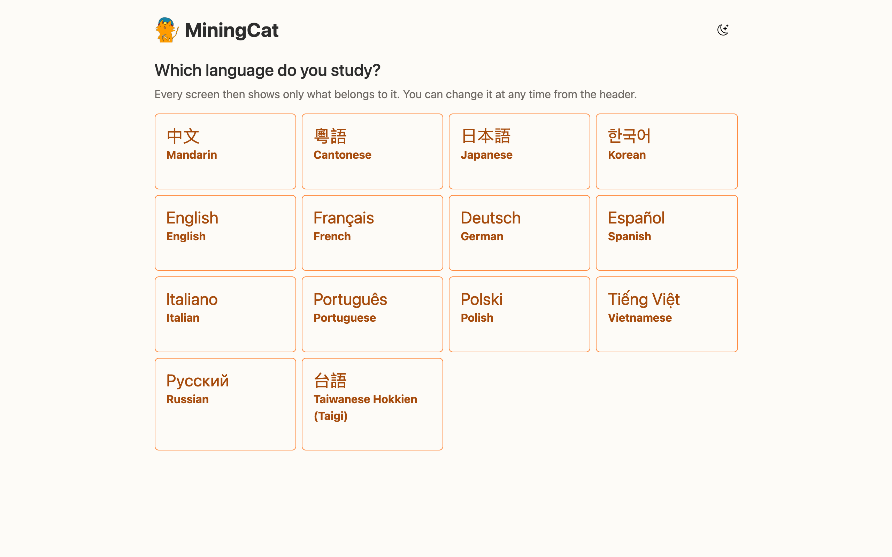
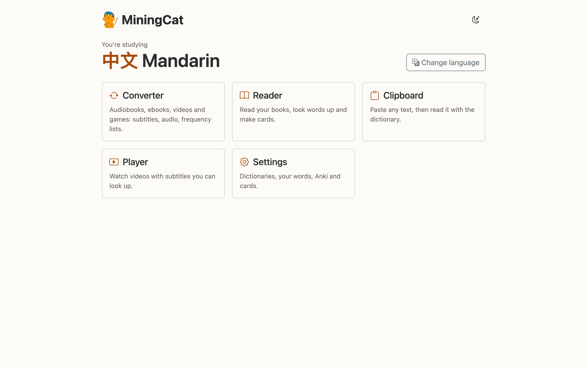

# Getting started
!!! warning
    Currently, there's not executable files for this project. Installation requires to use the terminal.

## Requirements

- **Python** 3.14 (the version used in CI; tested with 3.14.5)
- **ffmpeg**, used to split, convert and render audio and video
    - macOS: `brew install ffmpeg`
    - Debian/Ubuntu: `sudo apt install ffmpeg`
- **A web browser**: the GUI is a local web page (nothing is sent online)
- **make**, to use the shortcuts below (you can also call `python -m miningcat` directly, see [CLI reference](cli.md))

Everything else (Whisper, yt-dlp, edge-tts, OpenCC, [owocr](https://pypi.org/project/owocr/)...) is installed by `make install`.

## Installation

```bash
git clone https://github.com/linlin56/mining-cat.git
cd mining-cat

# Create and activate a virtual environment
python3 -m venv .venv
source .venv/bin/activate      # Windows: .venv\Scripts\activate

# Install the dependencies
make install
```

!!! tip
    The Makefile automatically uses `.venv/bin/python3` when it exists, so `make` commands work even if you forget to activate the environment.

## Launch the GUI

```bash
make gui
```

MiningCat starts a small local server and opens the GUI in your browser at <http://127.0.0.1:5050/>. Keep the terminal open while you use it, and press `Ctrl+C` there to stop it. Use `make gui PORT=8080` if the port is already taken.

### Choose the language you study

The home page first asks which language you study. Every screen then only shows what belongs to it: the converter's variants, the books of the reader, the videos of the player, and in the settings the dictionaries, words, Anki decks and cards of that language. Change it at any time with the language badge in the header of every page, which brings you back to the home page.



From the home page, open the **Converter**, the [Reader](reader.md), the [Player](player.md) or the **Settings**.



While MiningCat runs, your Discord profile shows what you do in it ("Reading a book", "Watching a video"...) and the language you study, if the Discord app is open on the same computer. Turn it off in **Settings › User preferences › Discord**.

You can drag and drop files on the audio, book and video panels. The files you pick are copied into the project's `sources/` folder, like before.

The converter's header has three settings shared by every workflow:

| Setting        | What it does                                                                                                                        |
| -------------- | ----------------------------------------------------------------------------------------------------------------------------------- |
| **Source**     | `Audiobook / Ebook`, `Video` or `Video game / Screen share`. Picks which screen you're working with.                                |
| **Variant**    | Only when the language studied has several (Mandarin: Taiwan or China, English: US or UK). It drives transcription, punctuation fixes, TTS voices and subtitle metadata. |
| **Convert to** | Only for Chinese variants: converts subtitles between simplified and traditional characters (e.g. read a mainland book in traditional). |

Then pick your workflow:

- [Audiobooks & ebooks](audiobook-ebook.md): one video per chapter, from a book and/or its audiobook.
- [Videos](video.md): subtitles for a YouTube, Instagram or Bilibili video, or a video file on your computer.
- [Video games & screen share](video-game.md): OCR the text of a game window, and mine it from a web page.

When you're done, the videos are in `output/final/`. Open them in MiningCat's [video player](player.md), or in any player you like, and start mining!

## Accepted inputs

| Input      | Formats                                                      |
| ---------- | ------------------------------------------------------------ |
| Ebook      | `.epub` (recommended), `.txt` (one or several files)         |
| Audiobook  | `.m4b` (split with its chapter markers), `.mp3`, `.m4a`, `.aac`, `.ogg`, `.wav`, `.flac`, `.opus` (one file per chapter) |
| Video      | A URL from a [supported platform](video.md#from-the-web), or any local video file ffmpeg can read |
| Video game | Any window on screen ([Linux and macOS](video-game.md#supported-systems)) |

See [Files and folders](files.md) for where everything ends up.
