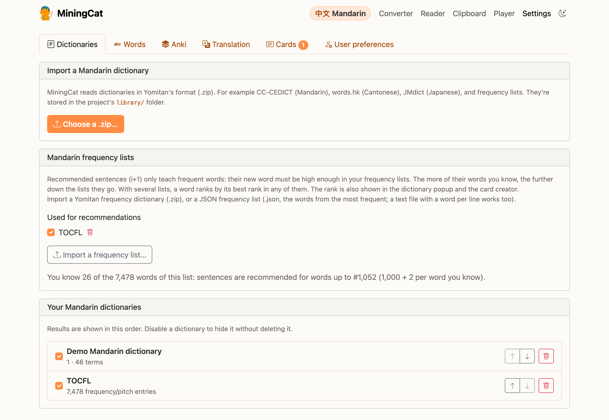
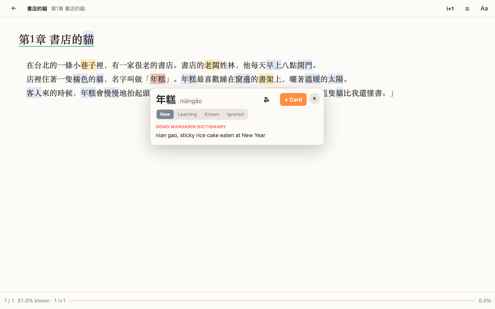
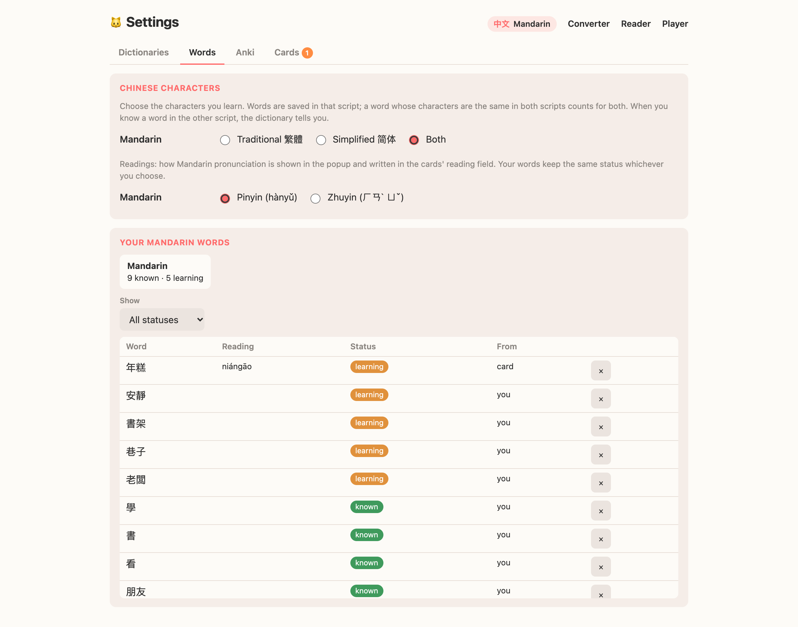
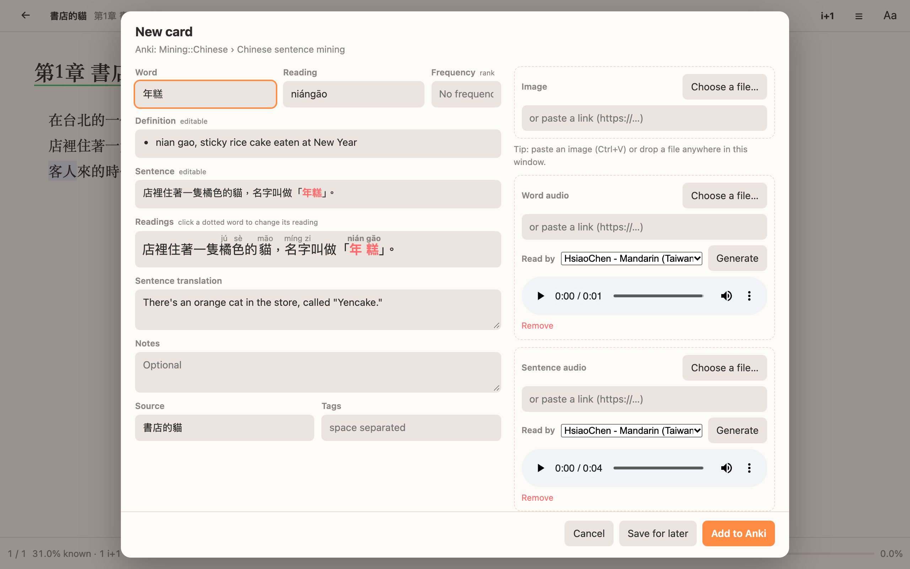
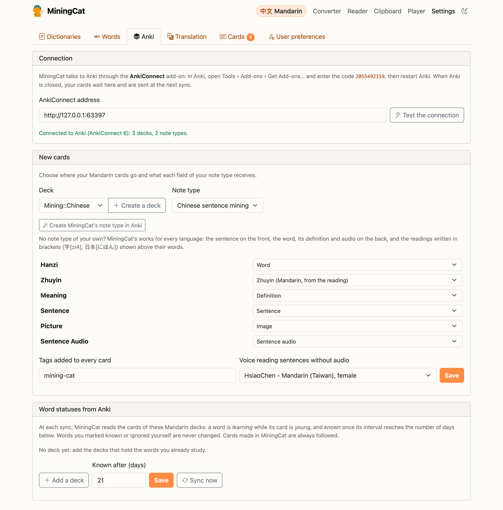
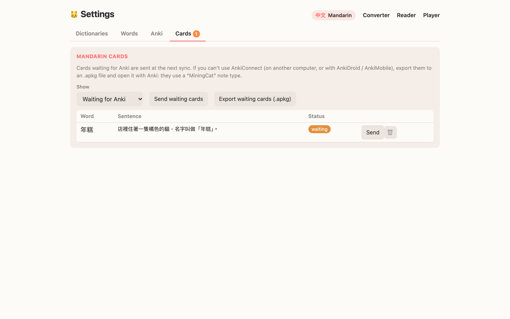

# Dictionaries & Anki cards

MiningCat has its own dictionary popup and card creator, so you don't need to install Yomitan. Everything is set up in **Settings** (link at the top of the converter and the library, or <http://127.0.0.1:5050/settings/>).

## 1. Import dictionaries

Settings › **Dictionaries** › *Choose a .zip…*

MiningCat reads dictionaries in [Yomitan's format](https://github.com/yomidevs/yomitan), so the dictionaries made for Yomitan work as they are: for example [CC-CEDICT](https://github.com/MarvNC/cc-cedict-yomitan/releases) (Mandarin, also in a zhuyin version), words.hk (Cantonese), [JMdict](https://github.com/yomidevs/jmdict-yomitan/releases) (Japanese), [Wiktionary dictionaries](https://github.com/yomidevs/kaikki-to-yomitan) (Korean and many more), and frequency lists.

Character dictionaries work too: KANJIDIC (Japanese) or CC-CEDICT Hanzi (Chinese). The popup then has a **Characters** section under each word, with the readings and meanings of each kanji / hanzi.

- Frequency lists are imported the same way, or in their own panel (see [frequency list](#frequency-list)).
- Dictionaries are imported for the language you study. A dictionary whose words are clearly in another language is refused: choose that language on the home page first.
- Results are shown in the order of the list: use ↑ ↓ to change it. Untick a dictionary to hide it without deleting it.
- When you've imported a frequency list, more frequent words come first in the results.

Dictionaries are stored in `library/miningcat.db`, with your words and cards.

## 2. Look up words in the reader

Click a word in the reader. The popup shows:

- the word, its reading, and how it was conjugated when you clicked an inflected form (Japanese, Korean, French, Spanish…: 泣いていた gives 泣く « -て « -いる « -た, 먹었어요 gives 먹다 « -았/었 « -아/어요);
- the definitions of every dictionary. A word has one entry per pronunciation (行 xíng and 行 háng are two entries, 行動 another one), whatever the dictionary and however it writes the reading: 行 xíng, 行 xing2 and 行 ㄒㄧㄥˊ are one entry. Its definitions are merged without repeats: "walk, OK" and "walk, go" give "walk, OK, go". Senses a dictionary tags differently (parts of speech, numbered senses) stay apart;
- the word's **status**: new, learning, known or ignored. Click to change it;
- its pitch accent (Japanese, with a pitch accent dictionary: たべꜜる [2]) or IPA, and its frequency ranks (hover the last chip for the others);
- **🔊** plays the word: JapanesePod101 for Japanese, and recordings from Wiktionary and Lingua Libre for every language. Click again for the next recording. These come from the Internet: nothing is sent until you click;
- the **Characters** of the word, with a character dictionary;
- a **+ Card** button.

With the keyboard, while the popup is open:

| Key | Action |
| --- | ------ |
| `↑` `↓` (or `K` `J`) | Pick a result |
| `Enter` or `C` | Make a card from it |
| `A` | Play the word |
| `P` | Play the sentence (books with audio) |
| `1` `2` `3` `4` | Status: new, learning, known, ignored |
| `Esc` | Close |

In the reader's settings (Aa), *Look up words* can be set to *Shift + hover* (like Yomitan), or *Off* if you prefer to keep using Yomitan.

## Word colours

The reader colours the words of the book by status, so you see at a glance what you don't know yet:

| Status   | Colour |
| -------- | ------ |
| New      | blue   |
| Learning | yellow |
| Known, ignored | none |

When two coloured words touch (Chinese, Japanese), every other one is a bit darker, so you can see where each word ends.

The text is split into words with your dictionaries, like the popup does: the longest word found from each character, conjugated forms included (泣いていた is the word 泣く). In Korean, the particles after a noun aren't coloured (친구와 is 친구 + 와). Words missing from your dictionaries (names, typos...) aren't coloured, and neither are rare or dialect words when a split into common words fits. Change a status in the popup, or make a card, and every occurrence of the word changes colour.

In the reader's settings (Aa), *Colour words* can be turned *Off*. The colours don't change the page itself, so Yomitan or other tools work on it as usual.

Your words and their statuses are listed in Settings › **Words**:

## Comprehension and recommended sentences

MiningCat tells you how much of a text you understand, and which sentences are the best ones to mine. Both come from your word statuses, so from your cards: a word is *learning* once you made its card, *known* when the card is mature in Anki (see [word statuses from Anki](#5-word-statuses-from-anki)), or as you marked it.

- **Comprehension**: the share of the text's running words that you know. Only words found in your dictionaries count (a name no dictionary knows can't have a status), ignored words excepted. A word seen ten times counts ten times.
- **Recommended sentences (i+1)**: sentences where you know every word but one, and that word is new. Its card is the next one to make, with a sentence you otherwise fully understand. A sentence whose only unknown word is already *learning* isn't recommended: that word has a card already. With a [frequency list](#frequency-list), the new word must also be frequent enough.

| Where | What you see |
| ----- | ------------ |
| Reader library | Each book's comprehension and number of i+1 sentences |
| Reader | The chapter's comprehension at the bottom, i+1 sentences underlined in green, and their list with `R` or the *i+1* button (click one to go to it) |
| Player library | Each video's comprehension and number of i+1 lines |
| Player | The comprehension above the subtitle list, i+1 lines marked in it (*Only i+1* to see only them), `N` to jump to the next one. A subtitle line counts as one sentence |
| Video game page | i+1 captures are marked |

Everything is updated as you go: make a card or mark a word known, and the numbers and the recommendations change.

## Frequency list

A frequency list tells MiningCat which words are worth learning first. Import it in **Settings › Dictionaries › Frequency list**:

- a Yomitan frequency dictionary (`.zip`), rank-based or occurrence-based;
- a JSON frequency list (`.json`): an array of the words, the most frequent first (`["的", "是", ...]`, or `[["的", "de"], ...]` with readings);
- a text file with a word per line, the most frequent first.

When several are imported, choose the one used for recommendations. For Chinese, a list in one script also ranks the words of the other.

With a frequency list, a sentence is only recommended when its new word ranks high enough. The limit grows with the words of the list you know (as *known*): **1,000 + 2 per word you know**. A beginner gets the most frequent words; knowing 3,000 words of the list, recommendations go up to #7,000. The settings show where you are. Sentences with a rarer new word are still counted, but not recommended.

The rank is also shown:

- in the dictionary popup: `★ #1,234` in green when the word is within your limit, `#12,345` beyond it, *Not in your frequency list* for a rare word;
- in the card creator, in the *Frequency* field. It goes to the `{frequency}` marker of your note type (MiningCat proposes it for a field named *Frequency*, *Freq* or *Rank*).

## 3. Make cards

**+ Card** opens the card creator, filled in with the word, its reading, the definition of the first dictionary, the sentence (the word in bold) and the book's title. Everything can be edited before sending:

- tick other dictionaries to add their definitions;
- add an image: *Choose a file*, drop one on the window, paste one with Ctrl+V, or paste a link;
- add the word's audio or the sentence's audio the same way. The word's audio is filled in when an online recording exists (when there are several, pick another one under *Recording*); when there's none, the word is read by the voice of the settings, as below (pick another voice under *Word audio* and click **Generate**), and for a book [converted with its audio](reader.md#audio-of-a-converted-book), so is the sentence's;
- when the sentence has no audio, it is read by the voice chosen for its language in **Settings › Anki** (*Voice reading sentences without audio*), with the same Edge-TTS voices as for generating a book's audio (an Internet connection is needed; Taigi's voice is local). Pick another voice under *Sentence audio* and click **Generate** to try it; choose *None* in the settings to only generate by hand;
- the sentence's translation is filled in, offline, in the language chosen in **Settings › Anki** (*Sentence translation*, English by default, *None* to turn it off). It uses [Argos Translate](https://github.com/argosopentech/argos-translate): the first time a language is translated, its model (about 100 MB) is downloaded; to download it ahead of time, or to remove models, use *Models* in the same panel. Cantonese and Taiwanese Hokkien have no model;
- edit the translation, add notes and tags.
- Mandarin: under the sentence, *Readings* shows the reading of every word of the sentence, chosen from your dictionaries by the context (跑得快 *de*, 我得走 *děi*, 長得高 *zhǎng*, 很長 *cháng*). A dotted word has other readings in your dictionaries: click it for the next one.

**Add to Anki** sends the card straight away. **Save for later** keeps it in MiningCat.

The word becomes *learning* as soon as the card is made.

## 4. Connect Anki

Settings › **Anki**

1. In Anki, install the AnkiConnect add-on: *Tools › Add-ons › Get Add-ons…*, code `2055492159`, then restart Anki.
2. Click *Test the connection*.
3. Under **New cards**, choose the deck and the note type of the language you study. No deck for it yet? **Create a deck** adds one to Anki, named after the language: *Mandarin (traditional) - MiningCat*, *Japanese - MiningCat*… (for Mandarin, the characters chosen in Settings › **Words**). MiningCat proposes what goes in each field of your note type from the field names (Hanzi → Word, Pinyin → Reading, Meaning → Definition…); change anything that doesn't fit, then *Save*.

### No note type yet?

Click **Create MiningCat's note type in Anki**: MiningCat adds a note type called “MiningCat” to Anki, selects it and fills in its fields. Choose a deck, then *Save*. It works for every language:

- **front**: the sentence, the card's word in bold (or the word alone when the card has no sentence). The readings are hidden: hover a word, or tap it on a phone, to see its own;
- **back**: the image, the sentence with its readings, its audio and translation, then the word with its reading, its audio and its definition, your notes and the source;
- **readings in brackets**: a reading written in brackets after its word is shown above it — `字[zi4]`, `日本[にほん]` (with Anki's space before the word: `今日は 日本[にほん]`), `台語[Tâi-gí]`, `peut-être[pø.tɛtʁ]`. A word in Chinese characters is the run of characters before the bracket; another word goes back to the last space or punctuation mark. Brackets with only a number (`[1]`) are left alone;
- **Mandarin**: readings with tone numbers are shown in pinyin with tone marks or in zhuyin, as chosen in Settings › **Words**, and colored by tone. MiningCat fills the sentence and the word with their readings (see below). Cantonese readings in jyutping are colored by tone too;
- **fonts**: the *Language* field (filled by MiningCat) picks the fonts of the language, so that the same character is drawn the Japanese, the traditional Chinese or the simplified Chinese way;

Once it is in Anki, the same button **updates** it: after a new MiningCat version, or after switching between pinyin and zhuyin. Changes you made to its templates in Anki are then replaced; your notes and the fields you added are kept.

!!! tip "Zhuyin"
    CC-CEDICT only gives pinyin. A *Zhuyin* or *Bopomofo* field gets **Zhuyin (Mandarin, from the reading)**: MiningCat converts the pinyin (說話 shuōhuà → ㄕㄨㄛ ㄏㄨㄚˋ). The pronunciation is the dictionary's: for the few words read differently in Taiwan (垃圾...), check the card.

!!! tip "Readings of the whole sentence"
    For Mandarin, two markers write the reading of every word in brackets after it, a format many Anki note types read: **Sentence with the reading of every word** (`{sentence_readings}`: `<b>繁體字[fan2 ti3 zi4]</b>你[ni3]都[dou1]看[kan4]得[de5]懂[dong3]嗎[ma5]？`) and **Word with its reading** (`{word_readings}`: `繁體字[fan2 ti3 zi4]`). Put them in the fields of your note type that hold the sentence and the word. The readings are those of the card creator's *Readings*: one per word, with tone numbers (5 for the neutral tone).

### When Anki is closed

Cards wait in MiningCat (Settings › **Cards**, with a counter) and are sent at the next sync. You can also export them as an `.apkg` file and open it in Anki, AnkiDroid or AnkiMobile. Exported cards use the “MiningCat” note type described above.

## 5. Word statuses from Anki

Under **Word statuses from Anki**, add the decks that hold the words you already study, with the name of the field that contains the word (and optionally the reading). At each **Sync now**, MiningCat:

1. sends the cards that were waiting;
2. reads these decks: a word is *learning* while its card is young, and *known* once its interval reaches the number of days you chose (21 by default, Anki's “mature”). Suspended cards are ignored;
3. updates the words of the cards made in MiningCat, wherever they are.

Words you marked *known* or *ignored* yourself are never changed by a sync.

## Languages and Chinese characters

Each language has its own words: knowing 說 in Mandarin says nothing about Cantonese. Settings › **Languages & words** lists them.

When you study a Chinese language, choose the characters you learn: **Traditional**, **Simplified** or **Both**.

- Words whose characters are the same in both scripts count for both.
- If you learn Traditional and look up 说话 in a simplified book, the word is saved as 說話, with Taiwan's characters for Mandarin (里面 is saved as 裡面) and Hong Kong's for Cantonese.
- Words written the same way in both scripts are saved as they are: 了解 and 台灣 are already traditional.
- When you know a word in the other script, the popup tells you (“You know this word in Simplified: 说话”).

For Taigi, choose the romanization of readings: **Tâi-lô** or **Pe̍h-ōe-jī** (see [Taigi](taigi.md)).

For Mandarin, also choose how readings are shown: **Pinyin** or **Zhuyin**. With Zhuyin, the popup and the card's *Reading* field show ㄕㄨㄛ ㄏㄨㄚˋ instead of shuōhuà, and with Pinyin a dictionary written in zhuyin is shown in pinyin. Words keep their status whichever you choose.

## Current limits

- Words are found from the longest dictionary match, without grammar analysis: a Japanese sentence can now and then be split in an unexpected place.
