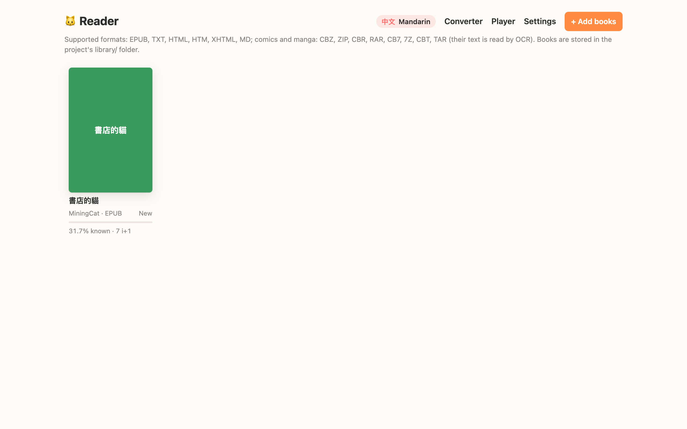
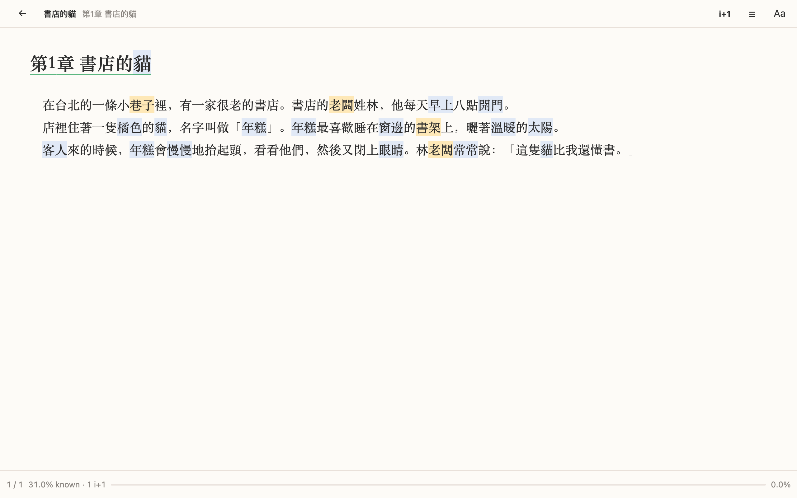
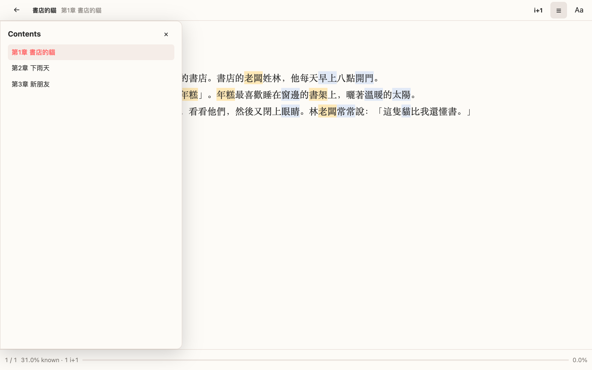
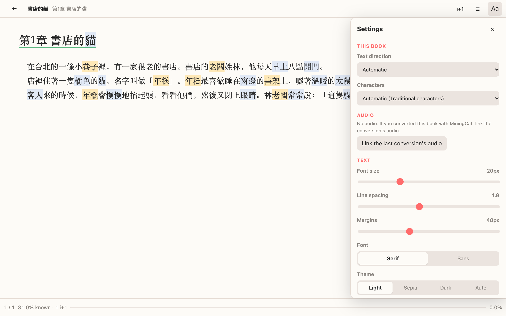

# Ebook reader

MiningCat includes a reader for your books. Words are coloured by status (new, learning), and a click on a word looks it up in your dictionaries to make an Anki card (see [Dictionaries & Anki cards](mining.md)). The text is plain text in a web page, so [Yomitan](https://github.com/yomidevs/yomitan) works on it too if you prefer it.

```bash
make reader
```

The reader opens at <http://127.0.0.1:5050/reader/>. It's also reachable from the **Reader** link at the top of the converter page (`make gui`).

## Library

Click **Add books** or drop files on the page. Supported formats:



| Format          | Notes                                                                                                                        |
| --------------- | ---------------------------------------------------------------------------------------------------------------------------- |
| EPUB            | Chapters, table of contents, images, furigana (ruby), notes and cross references. DRM-protected files can't be opened.       |
| TXT             | UTF-8, UTF-16, Big5, GB18030, Shift-JIS and EUC-KR are detected. Chapters are found from headings like `第1章`, `Chapter 1`, `제1장`. |
| HTML, Markdown  | Read as a single chapter.                                                                                                     |

Books are copied into the `library/` folder of the project, with their reading progress. Removing a book from the library deletes this copy, not your original file.

## Comics and manga

The library also takes comics and manga: drop their archive (or use **+ Add books**) (`.cbz`, `.zip`, and `.cbr`, `.cb7`, `.cbt` when your system's `bsdtar` reads them, as on macOS). A folder of images? Zip it first.

The text of each page is read by OCR the first time the page is shown (and the next pages while you read), then kept. On macOS it's Apple Live Text, which reads vertical text; elsewhere EasyOCR, horizontal text only. The lines read are grouped into speech bubbles and drawn over the page, where they were read.

- **Click a word** to look it up. The whole bubble is the card's sentence, and the page its picture (sentence audio: the voice of the card creator).
- **Text** (`T`, or 文): shown on hover (default), outlined, or always shown.
- **Pages**: one, two (side by side), or automatic (two when the window is wide); the cover can stand alone so that facing pages match the printed book. A double page scanned as one image always stands alone.
- **Reading direction**: right to left for Japanese and Chinese, left to right otherwise; change it per comic in **Aa**.
- **Characters of the text** (Mandarin): Traditional or Simplified, for the OCR.
- **Read these pages again**: when the text read is wrong (after changing the script, for example).

Keys: `←` `→` turn the page in the reading direction, `Space` / `Shift+Space` next / previous, `Home` `End`, `F` fullscreen. Clicking the page outside the text, or scrolling, turns it too.

Limits: no PDF yet, and the OCR reads text over busy backgrounds or sound effects poorly.

## Reading



| Action                 | How                                                                                     |
| ---------------------- | --------------------------------------------------------------------------------------- |
| Turn pages             | `←` `→`, `Space`, `Page Up/Down`, the mouse wheel, a click in the side margins, or a swipe |
| Contents               | `T` or ☰                                                                                |
| Recommended sentences  | `R` or *i+1* (see [comprehension and recommended sentences](mining.md#comprehension-and-recommended-sentences)) |
| Settings               | `S` or Aa                                                                               |
| Back to the library    | `Esc` or ←                                                                              |

In vertical text the book reads from right to left, so `←` goes to the next page.



Clicks on the text itself don't turn pages: they look words up (this can be changed in the settings).

## Settings



Per book:

- **Text direction**: automatic, horizontal or vertical (縦書き). Automatic uses vertical text for Japanese and Chinese EPUBs laid out from right to left, and horizontal text otherwise.
- **Characters** (Mandarin only): Traditional or Simplified, detected from the book's metadata and checked against its text. It picks the right fonts.

The library only shows the books of the language you study. A Chinese book imported while you study Cantonese or Taigi is filed under that language (Chinese text alone can't tell them apart); a book clearly in another language (e.g. Japanese while you study Mandarin) goes to that language's library.

For all books: font size, line spacing, margins, serif or sans-serif font, theme (light, sepia, dark, or following your system), showing or hiding furigana, how to look up words, and [word colours](mining.md#word-colours).

## Audio of a converted book

When you convert a book with its audiobook (or generate its audio with a voice), MiningCat can bring the audio to the reader:

- after the conversion, click **Read with audio** in the *Done* dialog: the book opens in the reader, with its audio;
- or, for a book already in the library, open **Aa** › *Audio* › **Link the last conversion's audio** (the conversion's files must still be in `output/`).

The audio and subtitles are copied next to the book in `library/`, so you can clear `output/` or convert another book afterwards.

Then, click a word: **▶ Sentence** in the popup plays its sentence, and the card creator gets the sentence's audio by itself (*Sentence audio*).

The sentence is found in the subtitles by its text, so it works even when the reader's chapters don't match the converted ones. With subtitles transcribed by Whisper (*Generate subtitles* mode), the transcription may differ a little from the book: the closest subtitle is used, and a sentence too different isn't found.

## Progress

Your position is saved automatically, as the exact character you're reading. It's restored when you open the book again, even after changing the font size, the window size or the text direction.
