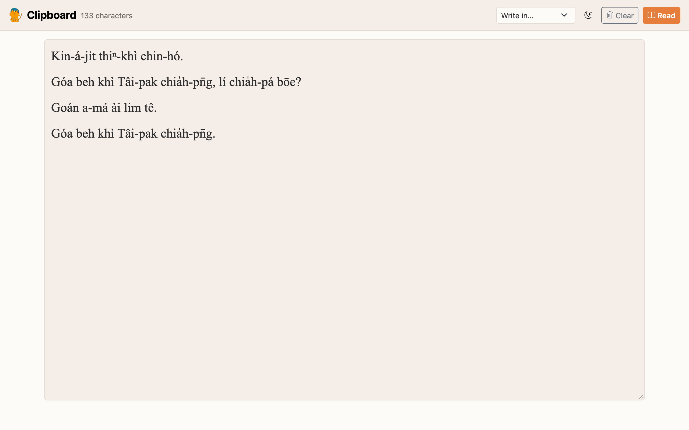
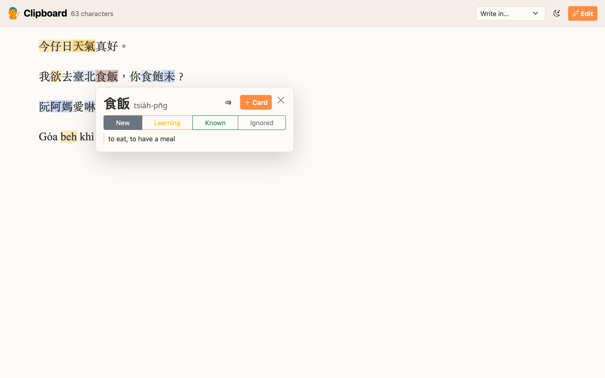
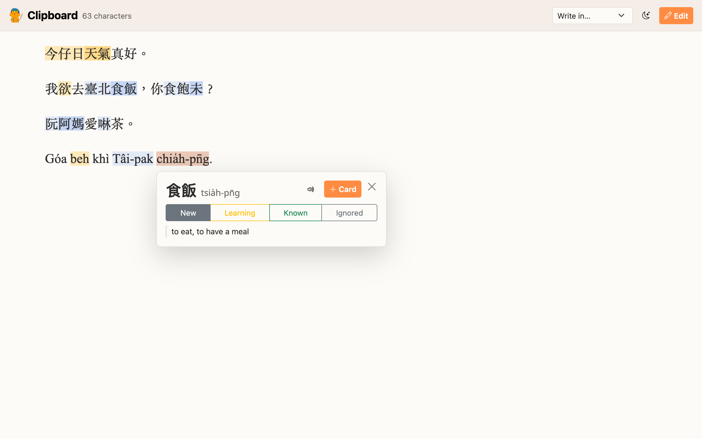
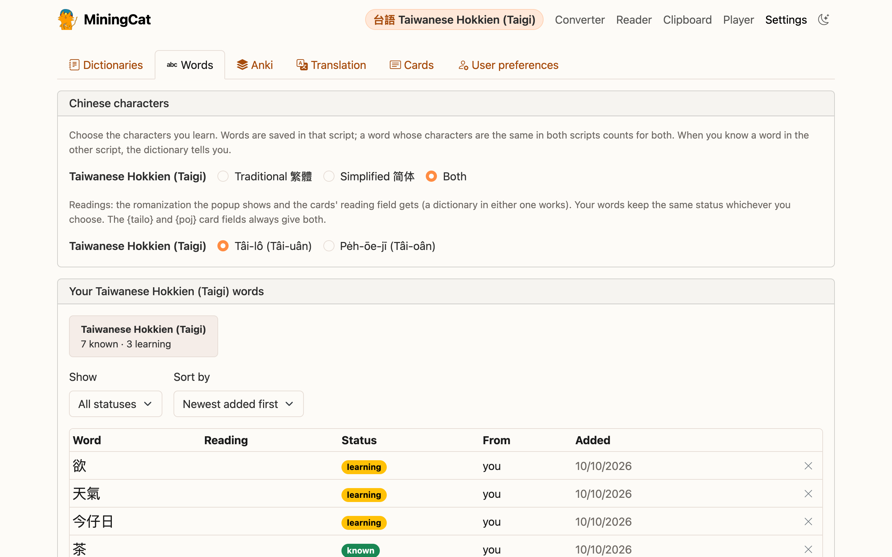

# Taiwanese Hokkien (Taigi)

Taigi is written in three ways, and MiningCat reads and converts all of them:

| Writing system | Example |
| -------------- | ------- |
| Hanji (漢字) | 我欲去臺北食飯。 |
| Tâi-lô (the Ministry of Education's romanization) | Guá beh khì Tâi-pak tsia̍h-pn̄g. |
| Pe̍h-ōe-jī (POJ, the church romanization) | Góa beh khì Tâi-pak chia̍h-pn̄g. |

Texts mixing Hanji and romanized words (Hàn-lô) are fine too.

## Speech: local engines

Whisper doesn't know Taigi and Edge has no Taigi voice, so Taigi uses other open-source engines, which run on your computer:

| Task | Engine |
| ---- | ------ |
| Transcription (*Generate subtitles*, videos) | [Qwen3-ASR](https://github.com/QwenLM/Qwen3-ASR) (Alibaba, Apache 2.0), which knows Minnan among its Chinese dialects |
| Aligning a book on its audiobook (*Standard*) | Meta's [MMS aligner](https://pytorch.org/audio/stable/tutorials/forced_alignment_for_multilingual_data_tutorial.html), on the book's text read as Tâi-lô |
| Speech synthesis (*Generate audio*, sentence audio of cards) | Meta's [MMS-TTS Taigi voice](https://huggingface.co/facebook/mms-tts-nan) |

Install them once with (the converter also offers it, in a pop-up, when you choose Taigi and they aren't installed):

```bash
make install-taigi
```

It installs [Qwen3-ASR](audiobook-ebook.md#qwen3-asr-optional) (`make install-qwen`, which can also replace Whisper for the other languages), then Meta's MMS, only used for Taigi.

Their models are downloaded the first time they're used: about 1.8 GB for Qwen3-ASR 0.6B (4.7 GB for 1.7B), 1.2 GB for the aligner, 140 MB for the voice. An NVIDIA GPU or an Apple Silicon Mac makes transcription much faster, but a CPU works.

!!! warning "Limits"
    - Qwen3-ASR writes what it hears in Chinese characters, often the Mandarin ones (要 rather than 欲): the subtitles of a video are a help to follow it, not a Hanji transcription to learn from.
    - The MMS voice was trained on Bible recordings in POJ: the text is read in POJ, whatever it's written in. Its licence (CC BY-NC 4.0) only allows non-commercial use.

In the converter, *Precision* picks Qwen3-ASR's size: **0.6B** (default) or **1.7B** (more accurate, slower). On the command line, `--model qwen3-0.6b` or `qwen3-1.7b` (Whisper sizes work too: `medium`, `large` and `turbo` use 1.7B).

## Converting between Hanji, Tâi-lô and POJ

- **Converter**: *Convert subtitles to* writes the subtitles of a book, an audiobook or a video in Hanji, Tâi-lô or POJ. On the command line: `--convert-to hanji|tailo|poj`, or `python -m miningcat convert --source nan --target poj` for the files of `output/srt/`.
- **Clipboard**: *Write in…* rewrites the pasted text in the system you pick.

    

- **Video game / Screen share**: the OCR'd text can be converted the same way.

Between the two romanizations, the conversion is exact, syllable by syllable (tone marks or tone numbers, o͘ / oo, ⁿ / nn, ch / ts...). Hanji are read with [taibun](https://github.com/andreihar/taibun) (the Ministry of Education's dictionary). Writing romanized text in Hanji is a best guess: a pronunciation often has several Hanji, the most common one is chosen, and a syllable without Hanji stays romanized.

## Dictionaries and cards

- Taigi dictionaries in Yomitan format are recognized at import from their readings (Tâi-lô or POJ).
- The popup works on Hanji and on romanized text: *chia̍h-pn̄g* or *tsia̍h-pn̄g* finds 食飯 in a Hanji dictionary from its reading, and romanized words are coloured by status like Hanji.
- An entry without a reading gets taibun's.
- In **Settings › Languages & words**, choose the romanization of the popup and of the cards' *Reading* field: **Tâi-lô** or **Pe̍h-ōe-jī**. A word saved in one is the same word in the other.
- Card fields: `{tailo}` and `{poj}` give the reading in each romanization, `{word_readings}` gives 食飯[tsia̍h-pn̄g], and `{sentence_readings}` gives the reading of every Hanji word of the sentence.






